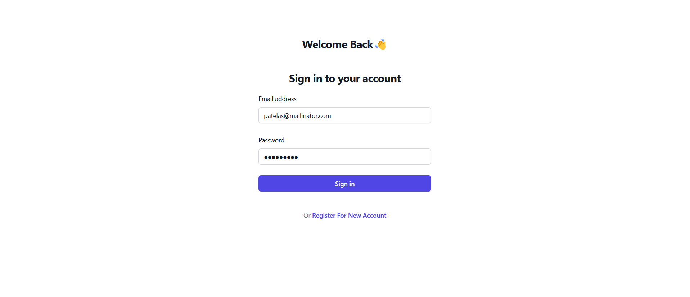
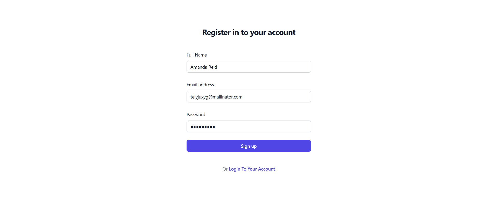
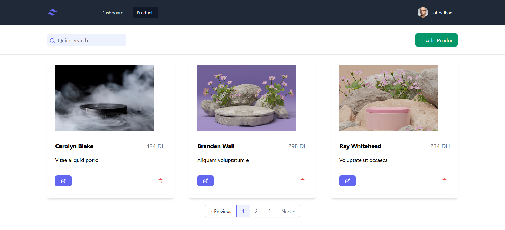

# Product-Management

Our **product management** web application, built with Laravel and Vue.js, allows users to store, manage, and organize their products. It offers user authentication and authorization, as well as features such as adding, editing, and deleting products, The application also includes search, pagination, and filtering functionalities to facilitate easy navigation and quick access to specific products.


## Tech Stack in

**Client:** Vue.js, TailwindCSS

**Server:** Php, laravel

**Database:** mySQL


## How to run the project

Clone the project

```bash
  git clone https://github.com/AbdelhaqNouhi/Product-Management.git
```

Run the project

*Client*

```bash
  cd client
```

```bash
  npm install
```

```bash
  npm run dev
```

*api*

```bash
  cd api
```

```bash
  php artisan migrate
```

```bash
  php artisan serve
```

## Endpoints

| Method    | Endpoint     | Description                |
| :-------- | :------- | :------------------------- |
| `POST` | `http://localhost:8000/api/register` | **Register** |
| `POST` | `http://localhost:8000/api/login` | **Login**|
| `GET` | `http://localhost:8000/api/product` | **Show Product**|
| `POST` | `http://localhost:8000/api/product` | **Create Product**|
| `PUT` | `http://localhost:8000/api/product/id` | **Update Product**|
| `DELETE` | `http://localhost:8000/api/product/id` | **Delete Product**|
| `GET` | `http://localhost:8000/api/product/{text}` | **Search for Product**|


**It's look like this**






## Authors

- [@Abdelhaq Nouhi](https://github.com/AbdelhaqNouhi)


#### Don't forget to give a ⭐ if you like this project.